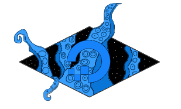

# Yog-Sothoth



[](https://travis-ci.org/Skarlso/yogsothoth)
[](https://coveralls.io/github/Skarlso/yogsothoth?branch=master)

Is a library providing the ability to handle Digital Ocean assets together.

For an example, please see [Furnace](https://github.com/Skarlso/go-furnace). More precisely under `furnace-do`.

Example yaml description file:

```yaml
Parameters:
  StackName:
    Description: The name of the stack to deploy
    Type: String
    Default: FurnaceStack
  Port:
    Description: Test port
    Type: Number
    Default: 80

Resources:
  Droplet1:
    Name: MyDroplet
    Region: region
    Size: size
    Backups: false
    IPv6: false
    PrivateNetworking: false
    Monitoring: false
    Type: Droplet
    Image:
      Slug: "ubuntu-14-04-x64"
  FloatingIP:
    Type: FloatingIP
    Region: nyc3
    DropletID: MyDroplet
  LoadBalancer:
    Name: TestBalancer
    Algorithm: random
    Region: nyc3
    Tag: BalancerTest
    RedirectHttpToHttps: true
    HealthCheck:
      Protocol: http
      Port: 1234
      Path: /health
      CheckIntervalSeconds: 15
      ResponseTimeoutSeconds: 150
      HealthyThreshold: 2
      UnhealthyThreshold: 4
    Type: LoadBalancer
    DropletIDs:
      - MyDroplet
  FireWall:
    Name: MyFirewall
    InboundRules:
      Inbound1:
        Protocol: ProtocolValue
        PortRange: 2345:2345
        Sources:
          Addresses:
            - skarlso.io
            - nagios.skarlso.io
          Tags:
            - Multiple
            - Tags
          DropletIDs:
            - 1234
          LoadBalancerUIDs:
            - UID1
            - UID2
    OutboundRules:
      Outbound1:
        Protocol: ProtocolValue2
        PortRange: 1234:2345
        Destinations:
          Addresses:
            - skarlso.io
            - nagios.skarlso.io
          Tags:
            - Outbound
            - Tags
          DropletIDs:
            - 4321
          LoadBalancerUIDs:
            - UID3
            - UID4
    DropletIDs:
      - MyDroplet
      - 12
```

This is currently in development. For upcoming things, please consult the [ROADMAP](./ROADMAP.md).
